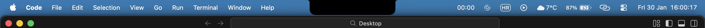
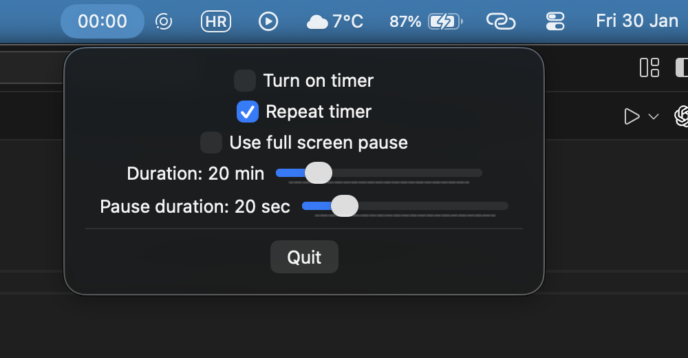
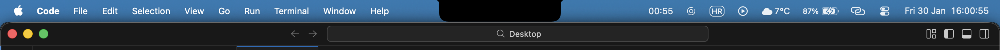
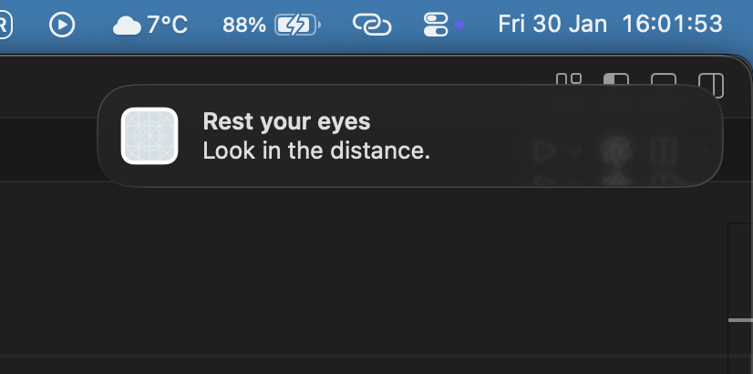

Jednostavna aplikacija koja omogućuje postavljanje brojača koji podsjeti korisnika da pogleda barem 20 metara u daljinu na barem 20 sekundi za zaštitu očiju.

## Screenshots

  <h2>Menu bar</h2>
  

  <h2>Settings</h2>
  

  <h2>Active timer</h2>
  

  <h2>Alert</h2>
  

