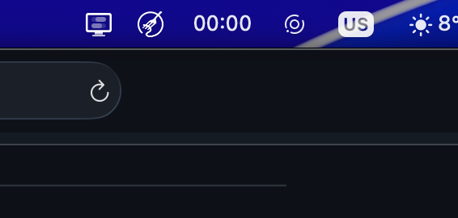
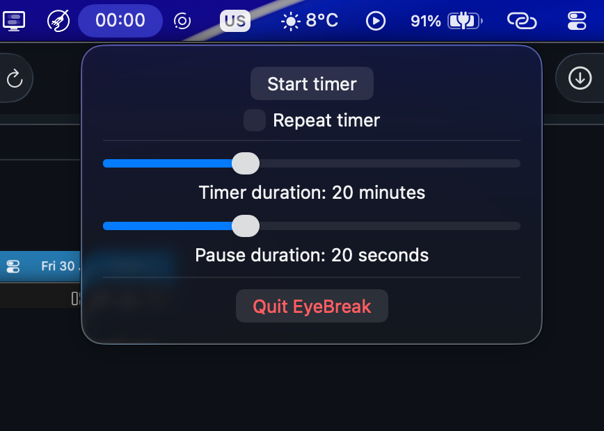
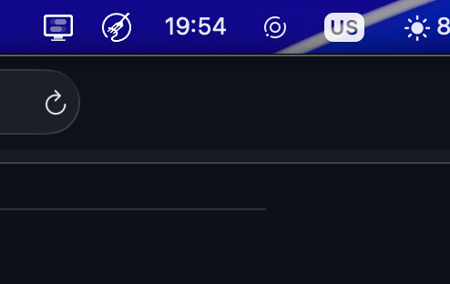
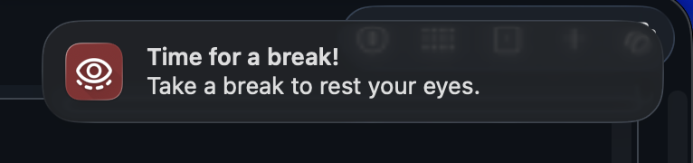

## EyeBreak
A simple app that lets users set a timer to remind them to look at least 20 meters away for a few seconds, helping protect their eyes.

## Screenshots
### Menu bar

  

### Settings

  

### Active timer

  

### Alert

  

